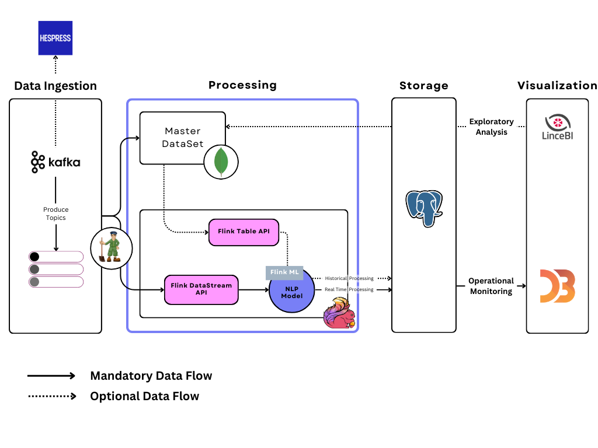
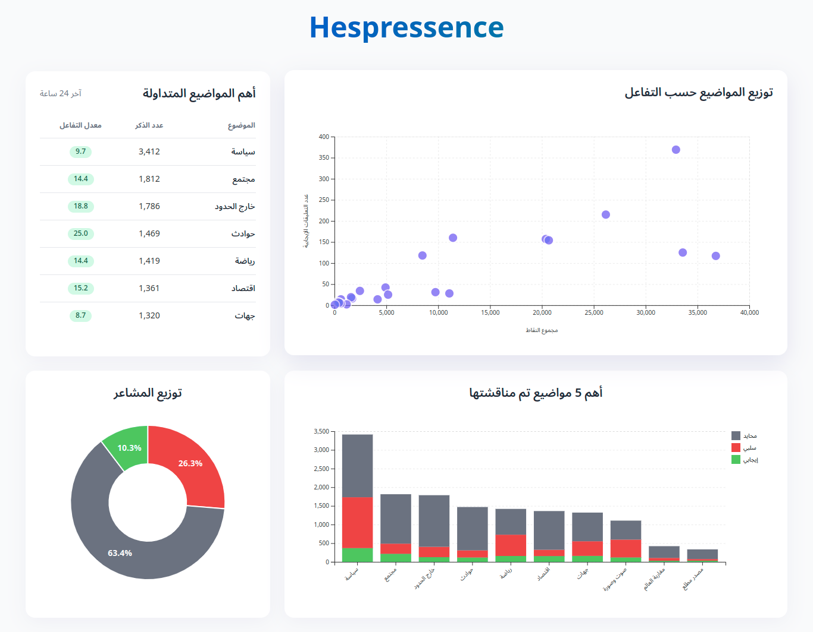

# Kappa Architecture Based Sentiment Analysis System for User Comments

## Overview

**Hespressence** is a system designed to collect and analyze user-generated comments from **Hespress.com**. The system enables both exploratory analysis and real-time sentiment trend detection through a unified stream processing architecture. By adopting the **Kappa Architecture**, it treats all data as streams, simplifying the integration of batch and stream processing for enhanced scalability and consistency.

The system uses Apache Kafka for data ingestion, Apache Flink for stream processing, MongoDB for historical data storage, and PostgreSQL for analysis results and real-time processing. The visualization layer is powered by D3.js, providing an interactive dashboard for sentiment analysis and trend monitoring.

## Project Team

This project was carried out by **Ouchen Oussama** and **Elaaly Hamid**.

## Supervision

The project was supervised by professors **Es-saady Youssef** and **El Hajji Mohamed**.

This project was developed within the program of the **BigData & AI Master's - FPT**, for classes **DeepLearning2** and **BigData2**.

## Architecture

Below is a high-level overview of the **Hespressence** system architecture:



## Features

- **Data Ingestion**: Kafka is used to ingest comment events in real-time with partitioning for maintaining article-wise comment ordering.
- **Stream and Batch Processing**:
  - **Stream Processing**: Real-time sentiment analysis using Apache Flink's DataStream API.
  - **Batch Processing**: Historical comment analysis using MongoDB for raw data storage and Flink's Table API for processing.
- **Storage**: PostgreSQL serves as a unified database for both real-time and historical analysis, while MongoDB holds raw event data.
- **Sentiment Analysis**: Sentiment scores and trends are computed, supporting real-time and historical sentiment analysis.
- **Visualization**: A custom dashboard powered by D3.js for interactive sentiment visualizations and operational monitoring.

## Requirements

- Python 3.x
- Apache Kafka
- Apache Flink
- MongoDB
- PostgreSQL
- Docker
- Docker Compose
- Additional Python packages listed in `requirements.txt`

## Setup

### 1. Clone the repository

```bash
git clone https://github.com/OuchenOussama/hespressence.git
cd hespressence
```

### 2. Dataset & Model File Download

Due to the massive size of the `model.h5` file, it has been uploaded to Google Drive. You can download it from the following link:

[Download model.h5](https://drive.google.com/file/d/1KLvUqNJ9HNkYbbA7qw9Z9OfjLeBXs44g/view?usp=sharing)

This model was obtained through the notebook : [Model Colab Notebook](https://colab.research.google.com/drive/18nUeijbLJ-TylOsUuoWV8SltvnoITZmF)

Training was performed on a [dataset](https://drive.google.com/file/d/1APBQB6KiNWQlpIS7RNo0FnRn8w-BlL9F/view) that consists of approximately 16,000 comments scraped from Hespress.

After downloading, place the file in the `src/model` folder.

### 3. Docker Setup

To run the necessary services (Kafka, Zookeeper, MongoDB, PostgreSQL) via Docker Compose, run:

```bash
docker compose up -d --build
```

This will start all the services required for the application and will run the comment scraping process

The data processing service (real-time and historical processing) are started through (automatically after build):

```bash
src/main.py
```

### 4. Access the Dashboard

Once the Docker container has been built and everything is up and running, the dashboard built with Flask and D3.js is accessible at:

```bash
http://localhost:5000
```




## Configuration

The application's settings are managed through `src/config/settings.py` :

- **Kafka settings**: Topic names, broker addresses, and partition strategies.
- **Flink settings**: Flink cluster configuration, job execution settings.
- **Database settings**: PostgreSQL and MongoDB connection parameters.
- **Scraper settings**: Configuration for scraping and merging comment data.

## Usage

- **Scraping**: Scrape comments from the website using the `scraper_rss.py` script within the Kafka , which collects data and sends it to Flink for processing.
- **Processing**: Real-time sentiment analysis is performed using Flink, and the results are sent to PostgreSQL.
- **Monitoring**: Track trends and monitor sentiment patterns for ongoing conversations, deep analysis of sentiment across different topics and timeframes through the dashboard.
- **Exploratory Analytics**: The Master DataSet persistent historical data storing allows for flexible, ad-hoc metrics in a non predefined manner.
